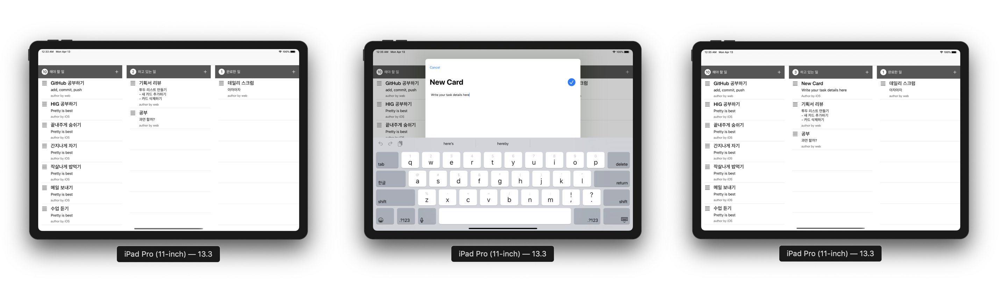

# Todo List iOS

## 단계별 구현 내용

### 투두 리스트 보드 화면 구현

> [PR #18 [iOS] Todo List Board UI 구현][pr18]

* 스토리보드로 기본 UI 구성
* URLProtocolMock을 구현하여 네트워크 통신 시에 Mock Data가 돌아오도록 구현
* ViewModel과 DataSource 클래스 구현
* Mock Data 표시
* 뷰모델 테스트

Related issues: [#2][issue2], [#8][issue8], [#15][issue15] and [#22][issue22]

**실행 결과**

### 새 할일 카드 추가하기

> [PR #28 [iOS] 새로운 카드 추가 기능 구현][pr28]

* 스토리보드로 새 카드 추가 Form 구성
* 새 카드 추가 Form에 스크롤뷰를 적용하여 키보드에 반응하도록 구현
* 서버에 새 카드 추가 요청을 하고, ID를 반환받도록 구현
* 반환받은 ID와 제출된 정보로 새 카드 인스턴스를 만들고, 모델에 추가
* 테이블뷰를 전체 reload하지 않고, 뷰모델에서 카드 리스트의 변화를 알려서 테이블뷰의 insert된 행만 애니메이션으로 업데이트하도록 구현

Related issues: [#23][issue23], [#24][issue24] and [#26][issue26]

**실행 결과**

[pr18]: https://github.com/codesquad-member-2020/todo-4/pull/18
[pr28]: https://github.com/codesquad-member-2020/todo-4/pull/28

[issue2]: https://github.com/codesquad-member-2020/todo-4/issues/2
[issue8]: https://github.com/codesquad-member-2020/todo-4/issues/8
[issue15]: https://github.com/codesquad-member-2020/todo-4/issues/15
[issue22]: https://github.com/codesquad-member-2020/todo-4/issues/22

[issue23]: https://github.com/codesquad-member-2020/todo-4/issues/23
[issue24]: https://github.com/codesquad-member-2020/todo-4/issues/24
[issue26]: https://github.com/codesquad-member-2020/todo-4/issues/26
