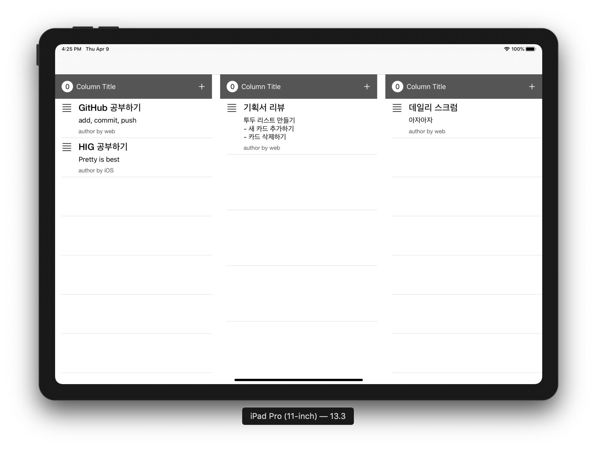

# Todo List iOS

## 단계별 구현 내용

### 투두 리스트 보드 화면 구현

> [PR #18 [iOS] Todo List Board UI 구현][pr1]

* 스토리보드로 기본 UI 구성
* URLProtocolMock을 구현하여 네트워크 통신 시에 Mock Data가 돌아오도록 구현
* 뷰모델과 데이터소스 클래스 구현
* Mock Data 표시

**실행 결과**

[pr1]: https://github.com/codesquad-member-2020/todo-4/pull/18

